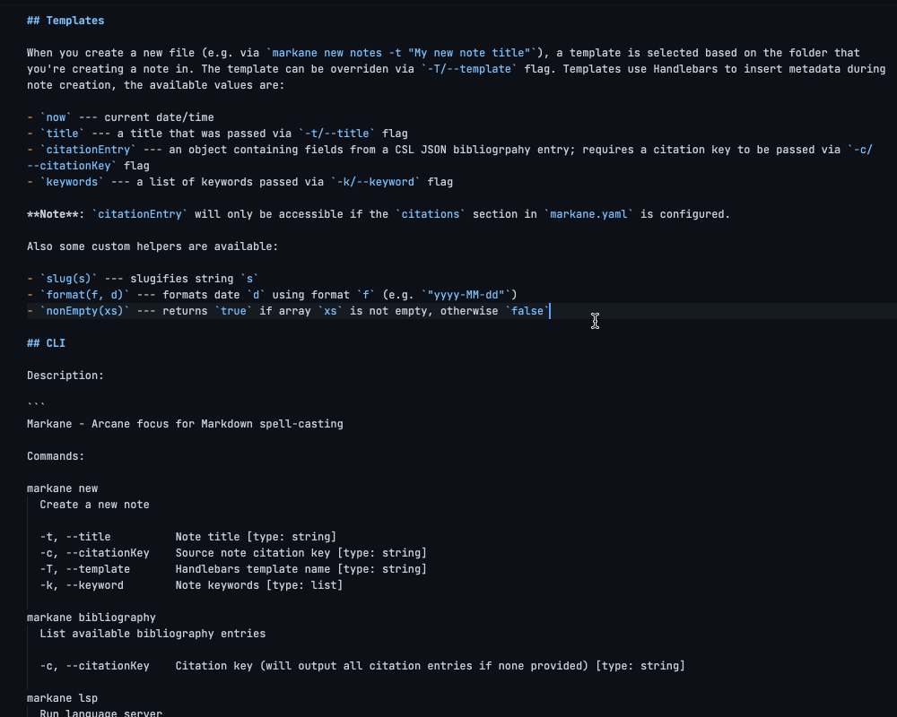
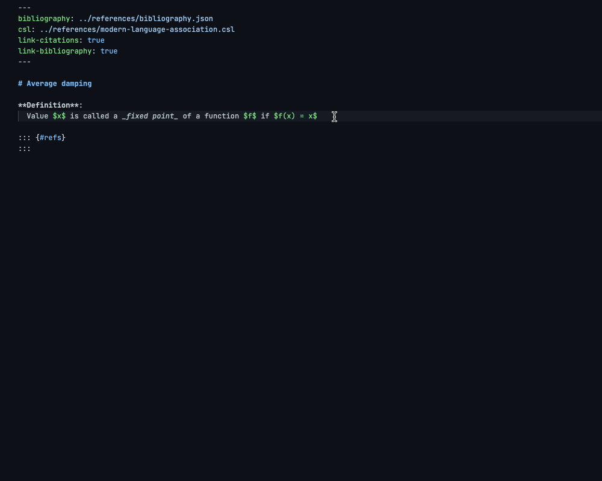
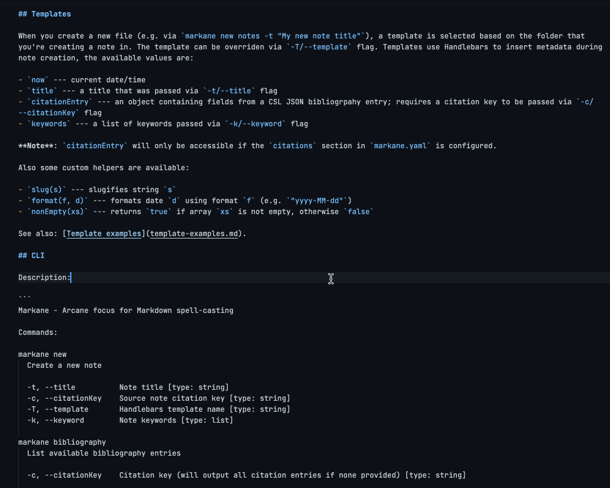
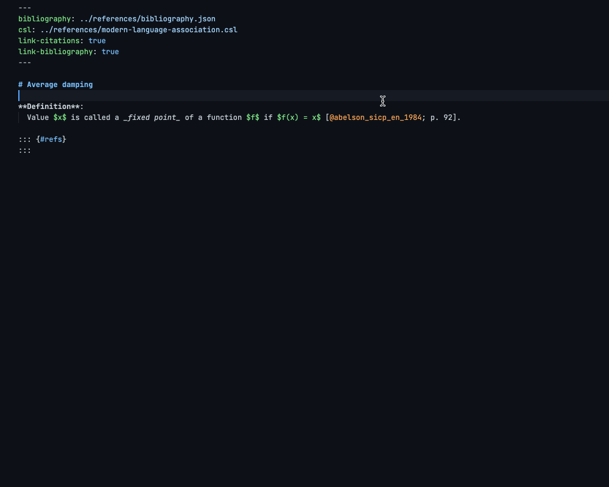
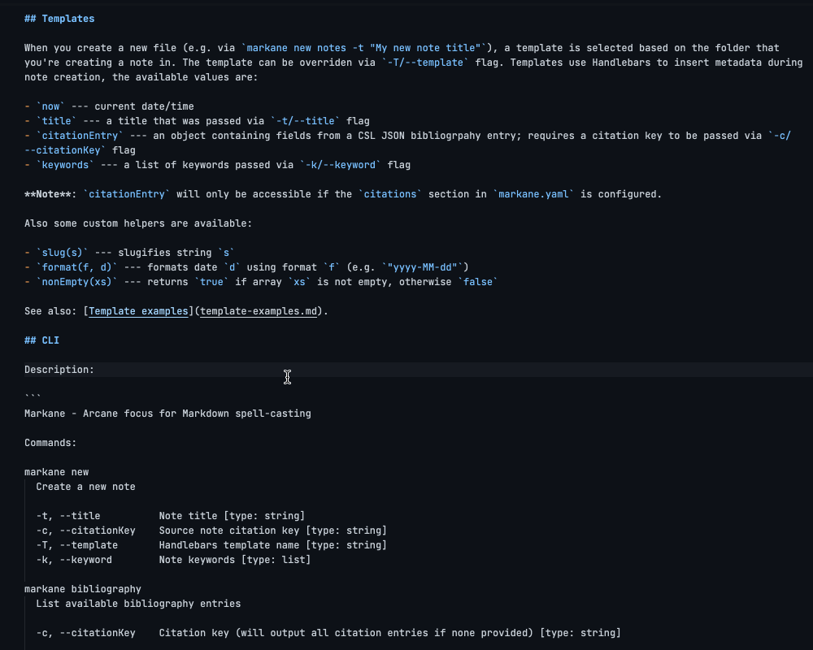
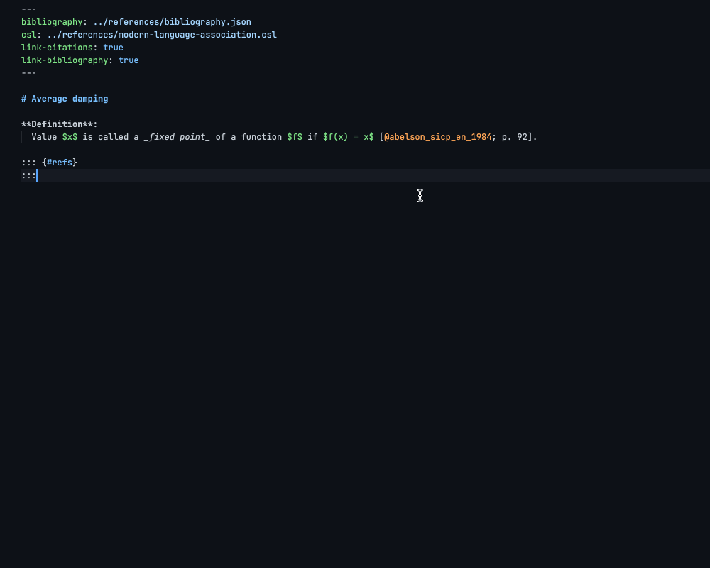
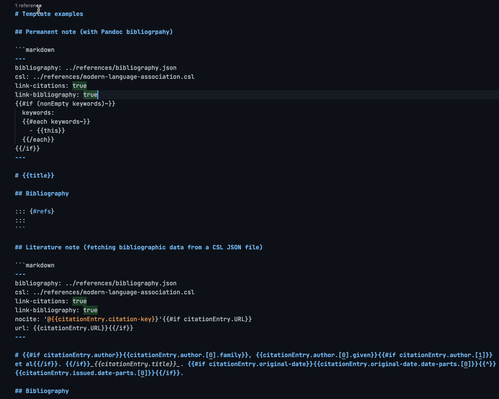
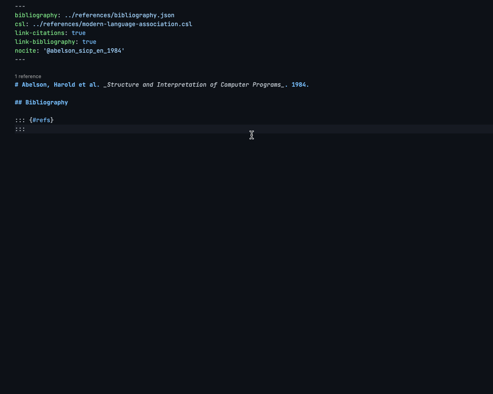

# Markane for VS Code

[VS Code Marketplace](https://marketplace.visualstudio.com/items?itemName=garlicbreadcleric.markane) |
[Open VSX](https://open-vsx.org/extension/garlicbreadcleric/markane) |
[GitHub](https://github.com/garlicbreadcleric/vscode-markane)

_Arcane focus for Markdown spell-casting_

## Description

Markane is a command-line tool for taking Markdown notes and navigating between them. The preferred Markdown dialect is Pandoc Markdown, although you can use it with CommonMark if you don't use some Pandoc-related features. Markane features include:

- Creating notes from Handlebars templates
- Preview on hover (links, images, citations)
- Auto-completion (links, citations, snippets)
- Go-to-definition (links, citations)
- Backlinks (links, citations)

## Documentation

- [Getting started](https://github.com/garlicbreadcleric/markane/blob/main/docs/getting-started.md)
- [Editor integration](https://github.com/garlicbreadcleric/markane/blob/main/docs/editor-integration.md)
- [Template examples](https://github.com/garlicbreadcleric/markane/blob/main/docs/template-examples.md)

## Features

### Auto-completion

Links

Citations

### Preview on hover

Links

Citations

### Go to definition

Links

Citations

### Backlinks

Links

Citations

## Similar projects

- mickael-menu's [zk](https://github.com/mickael-menu/zk) — a similar tool with a more powerful command-line interface. Supports `[[wiki-links]]` and `#hashtags` and has the ability to query notes from CLI; doesn't support `@citations` and `/snippets`.
